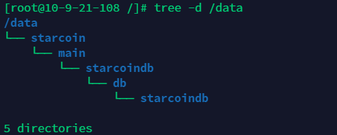

# Run a node on Windows

Environment: Windows 10


## Download the latest version of the software <a href="#yyl7b" id="yyl7b"></a>

download link: [https://github.com/starcoinorg/starcoin/releases/latest](https://github.com/starcoinorg/starcoin/releases/latest)


## Create a new directory and extract the compressed file

The newly created directory should not contain spaces and special characters.

In addition, prepare a data directory;

The completed result is as follows:

.png>)

## Run a node <a href="#iyrgp" id="iyrgp"></a>

### show help <a href="#zgikp" id="zgikp"></a>

Enter the decompressed "starcoin-artifacts" directory, enter cmd in the address bar and press Enter (there should be `starcoin.exe` in the directory), and enter the following command at the command prompt:

> Hint:
>
> * If there is a pop-up window prompting permission after running the command, please allow it;
> * After the tutorial, enter the cmd window. If no special instructions are given, it will be entered in the decompressed directory;

```
starcoin.exe -h
```

This command is to view the help. The first line will return the software version. The screenshot of the command is as follows:

 (1).png>)

### Run <a href="#dvjh0" id="dvjh0"></a>

After running the following command, do not close the window. To execute other commands, please open a new cmd window.

> Hint:
>
> * ^ at the end of each line: indicates that the command is not over and requires a newline;
> * \--net main: The network to start, the main network is main, and the test network is barnard;
> * \--miner-thread: The number of mining threads, which can be adjusted appropriately. If no mining is required, it can be set to 0;
> * \--node-name: node name, optional;
> * \--data-dir: Data storage directory, where C:\starcoin\node\data is the data directory created in the second step, which can be modified according to the situation;
> * \--stratum-address 0.0.0.0 --stratum-port 9880: start the mining pool function;

```powershell
starcoin.exe --net main ^
    --disable-metrics true ^
    --miner-thread 0 ^
    --node-name starcoin-main ^
    --data-dir C:\starcoin\node\data ^
    --logger-disable-file true ^
    --stratum-address 0.0.0.0 --stratum-port 9880
```

Screenshot below:

.png>)


Point 1:

* Http rpc address: Some(http://0.0.0.0:9850)
* TCP rpc address: Some(tcp://0.0.0.0:9860)
* Websocket rpc address: Some(ws://0.0.0.0:9870)


Point 2:(This is very important!!!)

* Ipc file path: \\.\pipe\starcoin\main\starcoin.ipc


Point 3:(data directory, the migration node can be copied and used to reduce the time-consuming of block synchronization.)

* Final data-dir is : `C:\starcoin\data\main`



## Export account and private key <a href="#h65dh" id="h65dh"></a>

### Connect to the Starcoin console <a href="#b40f1d7ab7ce8a042c7fc157db40a639" id="b40f1d7ab7ce8a042c7fc157db40a639"></a>

Prerequisite: Node is running

Connect to the console and see that `starcoin%` is returned at the end, which means that you have successfully reached the console:

```
starcoin.exe -c \\.\pipe\starcoin\main\starcoin.ipc console
```

.png>)


### View account and export private key <a href="#603e8a317e1ae66c0f224cb12c9f199a" id="603e8a317e1ae66c0f224cb12c9f199a"></a>

Prerequisite: Connecting the Starcoin console

View the default account:

```
account default
```

Export the private key of the default account:

```
account export 0x8b79fdf7bd004b72ea4bd83289429455
```

As shown in the figure below, the account and private key (private key) are exported, and the private key must be saved! ! !

.png>)

### Check account balance <a href="#e024ecc0a47d5aa9b300089b683cab90" id="e024ecc0a47d5aa9b300089b683cab90"></a>


You must wait for node data synchronization to complete to see the final balance.


```
account show 0x8b79fdf7bd004b72ea4bd83289429455
```



### Exit the console <a href="#0ddf58a8254b8d35123044cf7d67b617" id="0ddf58a8254b8d35123044cf7d67b617"></a>

Command:

```
$ exit
```

.png>)


## Block Explorer <a href="#aac9c43b1ce7ef0cbe1c4bc3e9b87f22" id="aac9c43b1ce7ef0cbe1c4bc3e9b87f22"></a>

Website: [https://stcscan.io](https://stcscan.io)

.png>)


