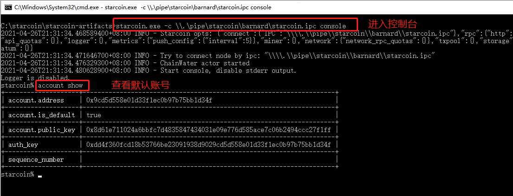

# 升级/迁移 Windows 节点

## 一、准备工作 <a href="#5634b8fb5e7251b57ac54e0571831eeb" id="5634b8fb5e7251b57ac54e0571831eeb"></a>

<mark style="color:red;">**必须先导出原节点私钥！！！**</mark>

私钥导出教程，[点击前往](zai-windows-shang-yun-hang-jie-dian.md#h65dh)

准备好私钥，用于导入节点账号。

## 二、停止原节点 <a href="#1ba854af870aaec04ff07f5ba28884d2" id="1ba854af870aaec04ff07f5ba28884d2"></a>

如果是迁移节点，可跳过该步骤。

Windows 中退出原节点的运行中断即可。

## 三、启动新节点 <a href="#86ef772c2a90b5fc349fa3551d81db9a" id="86ef772c2a90b5fc349fa3551d81db9a"></a>

将下载好的压缩包解压覆盖上个版本的文件即可；

.png>)

注：

* 若无需启动矿池，可以删除最后的参数：--stratum-address 0.0.0.0 --stratum-port 9880；
* \--net main：指定主网，测试网可写 barnard；

```powershell
starcoin.exe --net main ^
    --disable-metrics true ^
    --miner-thread 0 ^
    --node-name starcoin-main ^
    --data-dir C:\starcoin\data ^
    --logger-disable-file true ^
    --stratum-address 0.0.0.0 --stratum-port 9880
```

操作截图：


## 四、导入私钥并设为默认账号 <a href="#bbe435aa638eed8bca80dc643170856e" id="bbe435aa638eed8bca80dc643170856e"></a>

连接控制台（前提：节点运行中）：

```powershell
starcoin.exe -c \\.\pipe\starcoin\main\starcoin.ipc console
```

检查新版本默认账号：

```
account default
```

截图如下：



<mark style="color:red;">如果上面的账号是自己之前的，就结束了，如果账号不对，请导入私钥，并设置为默认账号。</mark>

导入私钥：

```
% account import -i 私钥
```

设置为默认账号：

```
% account default 私钥对应的账号
```


