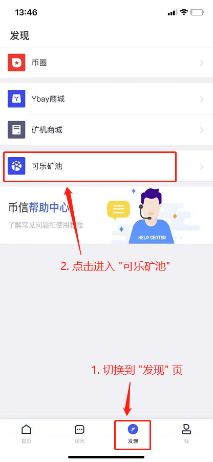
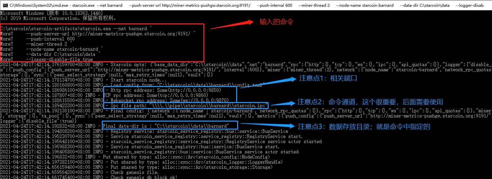
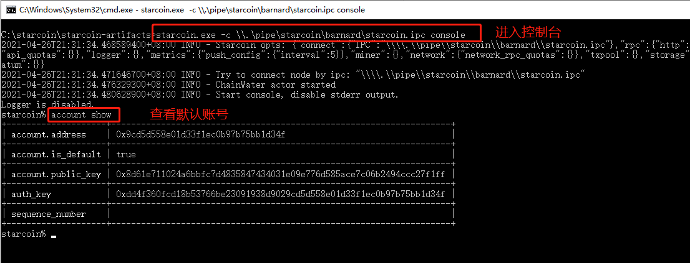
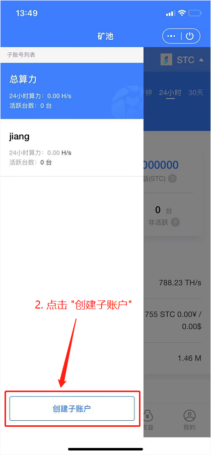
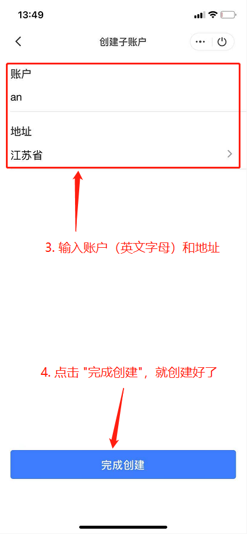

# GoldShell S1 Mini

Driver, Windows client and firmware download Link: [https://wwa.lanzoux.com/b0f8fa5sh](https://wwa.lanzoux.com/b0f8fa5sh) password: star

**Official Download Link:**&#x20;

* Windows Client v1.0.4: [https://github.com/starcoinorg/starcoin\_mini\_miner/releases/tag/v1.0.4](https://github.com/starcoinorg/starcoin\_mini\_miner/releases/tag/v1.0.4)​
* Firmware: [recovery 0.0.2](https://github.com/starcoinorg/starcoin\_mini\_miner/releases/download/v0.0.2/starcoin\_mini\_miner\_recovery\_v0.0.2.bin)​

## Install the driver and desktop client

### Install driver 

Download the driver file and unzip it:

.png>)

Find the driver installation program corresponding to the computer system in the decompressed file package, such as the Win10 system, select the `VCP_V1.5.0_Setup_W10_x64.exe` installation file:

.png>)

Double-click the selected driver installer and follow the installation wizard to complete the driver installation.&#x20;

Plug in the GoldShell S1 mini and make sure the device is found in Windows' Device Manager:

 (1).png>)

### Install client 

Download the client file, unzip it and instal.

 (4).png>)

### Upgrade firmware 

Download the file and unzip it.

 (1).png>)

After the computer is connected to the S1 Mini, you can check the firmware version of the S1 Mini. If the version is lower, you can upgrade the firmware.

 (2).png>)

 (2).png>)

After selecting the firmware, the upgrade begins!

.png>)

## Install Bixin Wallet APP and register

Download link：[https://www.bixin.im](https://www.bixin.im/?i=D6HQNGJJ)​

### Switch to STC Coin 

 

### Create mining sub-account 

  


Note:

The daily mining rewards will be transferred to the STC address of the Bixin wallet.


## Start mining 

* Pool Address: ccc.zxxx123.com port: 22


* Do not add stratum+tcp:// prefix to the pool name!
* Not support TLS。
* Kelepool TG: [https://t.me/kelepoolcom](https://t.me/kelepoolcom)


 (1).png>)

.png>)

​
