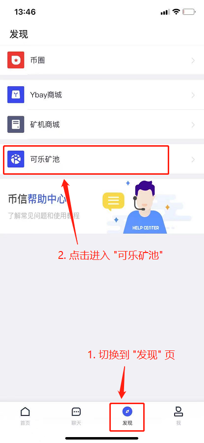
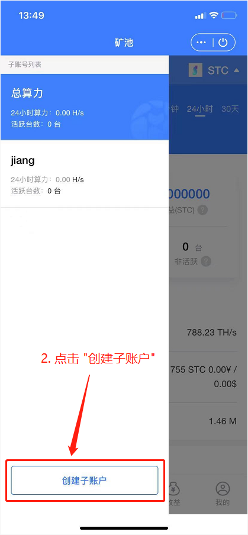

# 金贝 S1 Mini

**驱动、Windows客户端及固件下载地址**：[https://wwa.lanzoux.com/b0f8fa5sh](https://wwa.lanzoux.com/b0f8fa5sh) 密码: star

**官方下载地址：**

* Windows客户端：v1.0.4 [https://github.com/starcoinorg/starcoin\_mini\_miner/releases/tag/v1.0.4](https://github.com/starcoinorg/starcoin\_mini\_miner/releases/tag/v1.0.4)
* 固件：[recovery 0.0.2](https://github.com/starcoinorg/starcoin\_mini\_miner/releases/download/v0.0.2/starcoin\_mini\_miner\_recovery\_v0.0.2.bin)

## 一、安装驱动和桌面客户端 

### 1.1 驱动安装 

下载驱动文件并解压：

.png>)

在解压的文件包中找到电脑系统对应的驱动安装程序，如Win10系统选择VCP\_V1.5.0\_Setup\_W10\_x64.exe安装文件：

 (4).png>)

双击选择的驱动安装程序，根据安装向导提示，完成驱动的安装。

插入小机器，确保在Windows的设备管理器中能找到设备：

 (6).png>)

### 1.2 安装客户端 

下载客户端文件并解压安装：

 (7).png>)

### 1.3 固件更新 

下载客户端文件并解压：

 (5).png>)

电脑连接小机器后，查看固件版本，如果低了，可以升级固件：

 (5).png>)

 (3).png>)

选择好固件后，就开始升级啦！

 (4).png>)

## 二、安装币信钱包APP并注册

下载地址：[https://www.bixin.im](https://www.bixin.im/?i=D6HQNGJJ)

### 2.1 切换到 STC 页 

 .png>)

### 2.2 创建子账户 

创建的账户名不要用中文，后面会使用。

.png>)  

### 2.3 设置收款账号 

<mark style="color:red;">目前仅支持币信钱包，所以不用设置；</mark>

如果不设置，也会默认打到币信钱包的 STC 地址；

## 三、连接矿池 

### 3.1 连接矿池 

主网地址

* 地址：ccc.zxxx123.com 端口：22


* 矿池名前面不要加 stratum+tcp:// 前缀！
* 不支持 TLS。
* 可乐 TG 群，加入可获取最新通知：[https://t.me/kelepoolcom](https://t.me/kelepoolcom)


 (2).png>)

.png>)

### 3.2 收益 

STC会每天打到币信钱包的 STC 地址；

