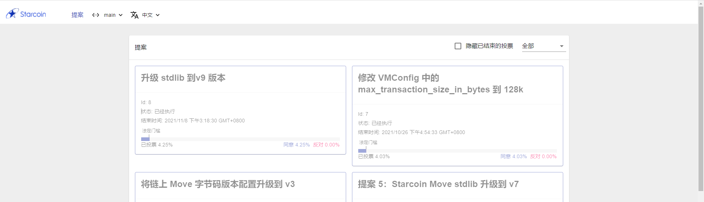

# 投票

地址：[https://poll.starcoin.org](https://poll.starcoin.org/polls/1?network=main)

持有 STC 的用户都可以参与社区自治。

> 【视频教程】
>
> * 如何参与投票：[https://www.youtube.com/watch?v=ut4WjdPDHrs](https://www.youtube.com/watch?v=ut4WjdPDHrs)
> * 如何领取投票空投：[https://www.youtube.com/watch?v=6wmABlTyg7E](https://www.youtube.com/watch?v=6wmABlTyg7E)

